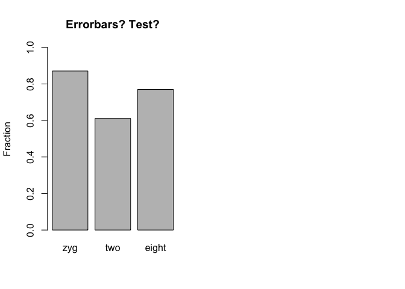
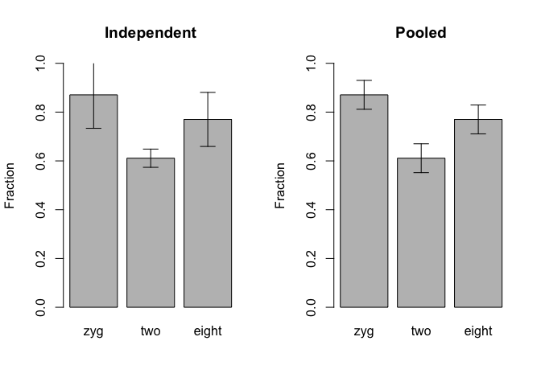
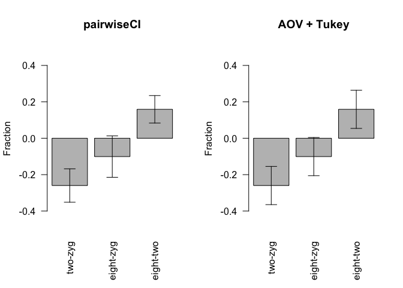

## Setup


```r
library(gridExtra)
library(pairwiseCI)
library(car)
library(agricolae)


# create some data 

my_data <- read.table("comp_LAD_fractions.txt", stringsAsFactors = FALSE)
my_data <- my_data[1:9,c(2,5)]

my_data$stage <- factor(my_data$stage, levels= unique(my_data$stage))
my_samples <-levels(my_data$stage)


n_group <- tapply(my_data$stage, my_data$stage, length)[1]
n_all <- nrow(my_data)

for(my_sample in my_samples){
    assign(my_sample, my_data$fraction.LADinB[my_data$stage == my_sample])
}
```


```r
xbar <- tapply(my_data$fraction.LADinB, my_data$stage, mean, na.rm = TRUE)

par(mfrow=c(1,2))
barplot(xbar, ylim=c(0,1), ylab="Fraction",  main="Errorbars? Test?")
```




## Confidence Intervals

### Independent


```r
### shortcut ###
t.test(zyg)
```

```
## 
## 	One Sample t-test
## 
## data:  zyg
## t = 27.313, df = 2, p-value = 0.001338
## alternative hypothesis: true mean is not equal to 0
## 95 percent confidence interval:
##  0.733563 1.007894
## sample estimates:
## mean of x 
## 0.8707287
```

```r
ind_CI_lower <- tapply(my_data$fraction.LADinB, my_data$stage, function(x){t.test(x)$conf.int[1]})
ind_CI_upper <- tapply(my_data$fraction.LADinB, my_data$stage, function(x){t.test(x)$conf.int[2]})

### details ###

ind_CI_lower2 <- xbar - tapply(my_data$fraction.LADinB, my_data$stage, 
                           function(x){qt(0.975, df = n_group-1)*sd(x)/sqrt(n_group)})

ind_CI_upper2 <- xbar + tapply(my_data$fraction.LADinB, my_data$stage, 
                           function(x){qt(0.975, df = n_group-1)*sd(x)/sqrt(n_group)})

# check
c(
identical(round(as.numeric(ind_CI_lower),6), round(as.numeric(ind_CI_lower2),6)),
identical(round(as.numeric(ind_CI_upper),6), round(as.numeric(ind_CI_upper2),6))
)
```

```
## [1] TRUE TRUE
```

### Pooled SD


```r
### shortcut ###
lm_fit <- lm(fraction.LADinB ~ 0 + stage, data = my_data)

summary(lm_fit)
```

```
## 
## Call:
## lm(formula = fraction.LADinB ~ 0 + stage, data = my_data)
## 
## Residuals:
##       Min        1Q    Median        3Q       Max 
## -0.061243 -0.016267  0.005635  0.015265  0.045978 
## 
## Coefficients:
##            Estimate Std. Error t value Pr(>|t|)    
## stagezyg    0.87073    0.02418   36.01 3.06e-08 ***
## stagetwo    0.61098    0.02418   25.27 2.53e-07 ***
## stageeight  0.76995    0.02418   31.84 6.38e-08 ***
## ---
## Signif. codes:  0 '***' 0.001 '**' 0.01 '*' 0.05 '.' 0.1 ' ' 1
## 
## Residual standard error: 0.04189 on 6 degrees of freedom
## Multiple R-squared:  0.998,	Adjusted R-squared:  0.997 
## F-statistic: 982.8 on 3 and 6 DF,  p-value: 1.831e-08
```

```r
pool_CI_lower <- confint(lm_fit)[,1]
pool_CI_upper <- confint(lm_fit)[,2]

### details ###
s <- tapply(my_data$fraction.LADinB, my_data$stage, sd, na.rm = TRUE)
s
```

```
##        zyg        two      eight 
## 0.05521663 0.01503797 0.04458858
```

```r
n <- tapply(!is.na(my_data$fraction.LADinB), my_data$stage, sum)
degf <- n - 1
degf
```

```
##   zyg   two eight 
##     2     2     2
```

```r
total.degf <- sum(degf)
total.degf
```

```
## [1] 6
```

```r
pooled.sd <- sqrt(sum(s^2*degf)/total.degf)
pooled.sd
```

```
## [1] 0.04188539
```

```r
pool_CI_lower2 <- xbar -  qt(0.975, df = total.degf)*pooled.sd*sqrt(1/n_group)
pool_CI_upper2 <- xbar +  qt(0.975, df = total.degf)*pooled.sd*sqrt(1/n_group)

# check
c(
identical(round(as.numeric(pool_CI_lower),6), round(as.numeric(pool_CI_lower2),6)),
identical(round(as.numeric(pool_CI_upper),6), round(as.numeric(pool_CI_upper2),6))
)
```

```
## [1] TRUE TRUE
```


```r
# plot
par(mfrow=c(1,2))
bplot <- barplot(xbar, ylim=c(0,1), ylab="Fraction",  main="Independent")
arrows(x0=bplot,y0=ind_CI_upper,y1=ind_CI_lower,angle=90,code=3,length=0.1)

bplot <- barplot(xbar, ylim=c(0,1), ylab="Fraction",  main="Pooled")
arrows(x0=bplot,y0=pool_CI_upper,y1=pool_CI_lower,angle=90,code=3,length=0.1)
```




## CI on Differences

### pairwiseCI


```r
# shortcut #
pair_CI <- pairwiseCI(fraction.LADinB ~ stage, data = my_data, var.equal=TRUE)

pair_CI_diffs   <-  pair_CI[[1]][[1]]$estimate
pair_CI_lower <- pair_CI[[1]][[1]]$lower
pair_CI_upper <- pair_CI[[1]][[1]]$upper


pair_CI
```

```
##   
## 95 %-confidence intervals 
##  Method:  Difference of means assuming Normal distribution and equal variances 
##   
##   
##           estimate   lower   upper
## two-zyg    -0.2597 -0.3515 -0.1680
## eight-zyg  -0.1008 -0.2145  0.0130
## eight-two   0.1590  0.0835  0.2344
##   
## 
```

```r
### details ###
pair_CI_lower2 <- c(t.test(two,zyg, var.equal = T)$conf.int[1], 
                    t.test(eight,zyg, var.equal = T)$conf.int[1], 
                    t.test(eight,two, var.equal = T)$conf.int[1])

pair_CI_upper2 <- c(t.test(two,zyg, var.equal = T)$conf.int[2], 
                    t.test(eight,zyg, var.equal = T)$conf.int[2], 
                    t.test(eight,two, var.equal = T)$conf.int[2])

# or
my_CI <- function(x,y){
    diff <- mean(x)-mean(y)
    s1 <- sd(x)
    s2 <- sd(y)
    se <- sqrt( (1/n_group + 1/n_group) * ((n_group-1)*s1^2 + (n_group-1)*s2^2)/(n_group+n_group-2) ) 
    df <- n_group+n_group-2
    diff + (qt(0.975, df = df)*se)*c(-1,1) 
}

pair_CI_lower3 <- c(my_CI(two,zyg)[1],my_CI(eight,zyg)[1],my_CI(eight,two)[1])
pair_CI_upper3 <- c(my_CI(two,zyg)[2],my_CI(eight,zyg)[2],my_CI(eight,two)[2])


# check
c(
identical(round(as.numeric(pair_CI_lower),6), round(as.numeric(pair_CI_lower2),6)),
identical(round(as.numeric(pair_CI_upper),6), round(as.numeric(pair_CI_upper2),6)),
identical(round(as.numeric(pair_CI_lower),6), round(as.numeric(pair_CI_lower3),6)),
identical(round(as.numeric(pair_CI_upper),6), round(as.numeric(pair_CI_upper3),6))
)
```

```
## [1] TRUE TRUE TRUE TRUE
```

### Anova + Tukey


```r
### Anova ###
aov_fit <- aov(fraction.LADinB ~ stage, data = my_data)

summary(aov_fit)
```

```
##             Df  Sum Sq Mean Sq F value   Pr(>F)    
## stage        2 0.10290 0.05145   29.32 0.000799 ***
## Residuals    6 0.01053 0.00175                     
## ---
## Signif. codes:  0 '***' 0.001 '**' 0.01 '*' 0.05 '.' 0.1 ' ' 1
```

```r
### side track on anove F-stat ##
resids <- c(zyg-mean(zyg), two-mean(two), eight-mean(eight))
SSE <- sum(resids^2)
MSE <-  (SSE/(length(resids)-length(my_samples)))
MSE
```

```
## [1] 0.001754386
```

```r
sqrt(MSE) == pooled.sd
```

```
## [1] TRUE
```

```r
SST <- sum((c(zyg,two,eight)-mean(c(zyg,two,eight)))^2)
SSR <- SST - SSE

round(SSR,6) == round(sum(c(rep(xbar,3) - mean(xbar))^2),6)
```

```
## [1] TRUE
```

```r
MSR <- (SSR/(length(my_samples)-1))
MSR
```

```
## [1] 0.05144823
```

```r
Fstat <- MSR / MSE
Fstat
```

```
## [1] 29.32549
```

```r
pval <- pf(q = Fstat, df1 = length(my_samples)-1, df2 = n_all-length(my_samples), lower.tail = FALSE)
pval
```

```
## [1] 0.0007993341
```

```r
# check
identical(round(as.numeric(pval),6), round(as.numeric(summary(aov_fit)[[1]][1,5]),6))
```

```
## [1] TRUE
```

```r
### Tukey test ##

posthoc <- TukeyHSD(x=aov_fit, conf.level=0.95)

posthoc
```

```
##   Tukey multiple comparisons of means
##     95% family-wise confidence level
## 
## Fit: aov(formula = fraction.LADinB ~ stage, data = my_data)
## 
## $stage
##                 diff         lwr          upr     p adj
## two-zyg   -0.2597474 -0.36468019 -0.154814636 0.0006633
## eight-zyg -0.1007757 -0.20570844  0.004157115 0.0581160
## eight-two  0.1589718  0.05403897  0.263904526 0.0083647
```

```r
tuk_diffs   <-  posthoc$stage[,1]
tuk_CI_lower <- posthoc$stage[,2]
tuk_CI_upper <- posthoc$stage[,3]


# details #
q_tukey <- qtukey(p = 0.95, nmeans = length(my_samples), df = total.degf)

tuk_CI_lower2 <- tuk_diffs - (q_tukey * sqrt( (MSE/2) * (1/(n_group) + 1/(n_group))))
tuk_CI_upper2 <- tuk_diffs + (q_tukey * sqrt( (MSE/2) * (1/(n_group) + 1/(n_group))))


# check
c(
identical(round(as.numeric(tuk_CI_lower),6), round(as.numeric(tuk_CI_lower2),6)),
identical(round(as.numeric(tuk_CI_upper),6), round(as.numeric(tuk_CI_upper2),6))
)
```

```
## [1] TRUE TRUE
```


```r
# plot
par(mfrow=c(1,2))
bplot <- barplot(pair_CI_diffs, ylim=c(-0.5,0.5), ylab="Fraction",  main="pairwiseCI", las=2)
arrows(x0=bplot,y0=pair_CI_upper,y1=pair_CI_lower,angle=90,code=3,length=0.1)

bplot <- barplot(tuk_diffs, ylim=c(-0.5,0.5), ylab="Fraction",  main="AOV + Tukey", las=2)
arrows(x0=bplot,y0=tuk_CI_upper,y1=tuk_CI_lower,angle=90,code=3,length=0.1)
```




### Pair-wise t-test on Pooled SD


```r
# no adjustment for comparison with lm
pairdiff <- pairwise.t.test(x = my_data$fraction.LADinB, g = my_data$stage, p.adjust.method = "none")

# outputs p-value
pairdiff
```

```
## 
## 	Pairwise comparisons using t tests with pooled SD 
## 
## data:  my_data$fraction.LADinB and my_data$stage 
## 
##       zyg     two    
## two   0.00027 -      
## eight 0.02572 0.00351
## 
## P value adjustment method: none
```


```r
# from the function (pooled sd same as above)
x = my_data$fraction.LADinB
g = my_data$stage

xbar <- tapply(x, g, mean, na.rm = TRUE)
s <- tapply(x, g, sd, na.rm = TRUE)
n <- tapply(!is.na(x), g, sum)
degf <- n - 1
total.degf <- sum(degf)
pooled.sd <- sqrt(sum(s^2 * degf)/total.degf)
dif <- xbar[2] - xbar[1]

my_CI <- function(x,y){
    dif <- mean(x) - mean(y)
    se.dif <- pooled.sd * sqrt(1/length(x) + 1/length(y))
    t.val <- dif/se.dif
    pval <- 2 * pt(-abs(t.val), total.degf)
    CI <- dif + qt(0.975, total.degf)*se.dif*c(-1,1)
    return(CI)
}

my_pval <- function(x,y){
    dif <- mean(x) - mean(y)
    se.dif <- pooled.sd * sqrt(1/length(x) + 1/length(y))
    t.val <- dif/se.dif
    pval <- 2 * pt(-abs(t.val), total.degf)
    return(pval)
}

pooldiff_CI_lower <- c(my_CI(two,zyg)[1],my_CI(eight,zyg)[1],my_CI(eight,two)[1])
pooldiff_CI_upper <- c(my_CI(two,zyg)[2],my_CI(eight,zyg)[2],my_CI(eight,two)[2])
pooldiff_pval <- c(my_pval(two,zyg)[1],my_pval(eight,zyg)[1],my_pval(eight,two)[1])
pooldiffs <- c(mean(two)-mean(zyg), mean(eight)-mean(zyg), mean(eight)-mean(two))
names(pooldiffs) <- names(pair_CI_diffs)
```


### Linear Regression


```r
# fit with intercept
lm_fit2 <- lm(fraction.LADinB ~ stage, data = my_data)
summary(lm_fit2)
```

```
## 
## Call:
## lm(formula = fraction.LADinB ~ stage, data = my_data)
## 
## Residuals:
##       Min        1Q    Median        3Q       Max 
## -0.061243 -0.016267  0.005635  0.015265  0.045978 
## 
## Coefficients:
##             Estimate Std. Error t value Pr(>|t|)    
## (Intercept)  0.87073    0.02418  36.006 3.06e-08 ***
## stagetwo    -0.25975    0.03420  -7.595 0.000271 ***
## stageeight  -0.10078    0.03420  -2.947 0.025722 *  
## ---
## Signif. codes:  0 '***' 0.001 '**' 0.01 '*' 0.05 '.' 0.1 ' ' 1
## 
## Residual standard error: 0.04189 on 6 degrees of freedom
## Multiple R-squared:  0.9072,	Adjusted R-squared:  0.8763 
## F-statistic: 29.33 on 2 and 6 DF,  p-value: 0.0007993
```

```r
# relevel for 3rd comparison
my_data$stage <- relevel(my_data$stage, ref = "two")

lm_fit3 <- lm(fraction.LADinB ~ stage, data = my_data)
summary(lm_fit3)
```

```
## 
## Call:
## lm(formula = fraction.LADinB ~ stage, data = my_data)
## 
## Residuals:
##       Min        1Q    Median        3Q       Max 
## -0.061243 -0.016267  0.005635  0.015265  0.045978 
## 
## Coefficients:
##             Estimate Std. Error t value Pr(>|t|)    
## (Intercept)  0.61098    0.02418  25.265 2.53e-07 ***
## stagezyg     0.25975    0.03420   7.595 0.000271 ***
## stageeight   0.15897    0.03420   4.648 0.003510 ** 
## ---
## Signif. codes:  0 '***' 0.001 '**' 0.01 '*' 0.05 '.' 0.1 ' ' 1
## 
## Residual standard error: 0.04189 on 6 degrees of freedom
## Multiple R-squared:  0.9072,	Adjusted R-squared:  0.8763 
## F-statistic: 29.33 on 2 and 6 DF,  p-value: 0.0007993
```

```r
# get values 
lm_fit_pval <- c(summary(lm_fit2)$coef[2:3,4], summary(lm_fit3)$coef[3,4]) 
lm_fit_diffs <- c(summary(lm_fit2)$coef[2:3,1], summary(lm_fit3)$coef[3,1]) 
names(lm_fit_diffs) <- names(pair_CI_diffs)
lm_fit_CI_lower <- c(confint(lm_fit2)[2:3,1], confint(lm_fit3)[3,1])
lm_fit_CI_upper <- c(confint(lm_fit2)[2:3,2], confint(lm_fit3)[3,2])


# check
c(
identical(round(as.numeric(lm_fit_CI_lower),6), round(as.numeric(pooldiff_CI_lower),6)),
identical(round(as.numeric(lm_fit_CI_upper),6), round(as.numeric(pooldiff_CI_upper),6)),
identical(round(as.numeric(lm_fit_pval),6), round(as.numeric(pooldiff_pval),6))
)
```

```
## [1] TRUE TRUE TRUE
```


```r
# plot
par(mfrow=c(1,4), cex=1.2)

bplot <- barplot(pair_CI_diffs, ylim=c(-0.5,0.5), ylab="Fraction",  main="pairwiseCI", las=2)
arrows(x0=bplot,y0=pair_CI_upper,y1=pair_CI_lower,angle=90,code=3,length=0.1)

bplot <- barplot(tuk_diffs, ylim=c(-0.5,0.5), ylab="Fraction",  main="AOV + Tukey", las=2)
arrows(x0=bplot,y0=tuk_CI_upper,y1=tuk_CI_lower,angle=90,code=3,length=0.1)

bplot <- barplot(lm_fit_diffs, ylim=c(-0.5,0.5), ylab="Fraction", main="Pw t-test Pooled SD", las=2)
arrows(x0=bplot,y0=lm_fit_CI_upper,y1=lm_fit_CI_lower,angle=90,code=3,length=0.1)

bplot <- barplot(pooldiffs, ylim=c(-0.5,0.5), ylab="Fraction",  main="Linear Regression", las=2)
arrows(x0=bplot,y0=pooldiff_CI_upper,y1=pooldiff_CI_lower,angle=90,code=3,length=0.1)
```


```r
### further details ###

mm <- model.matrix(lm_fit2)
mm
```

```
##   (Intercept) stagetwo stageeight
## 1           1        0          0
## 2           1        0          0
## 3           1        0          0
## 4           1        1          0
## 5           1        1          0
## 6           1        1          0
## 7           1        0          1
## 8           1        0          1
## 9           1        0          1
## attr(,"assign")
## [1] 0 1 1
## attr(,"contrasts")
## attr(,"contrasts")$stage
## [1] "contr.treatment"
```

```r
XX <- solve(t(mm) %*% mm)
XX
```

```
##             (Intercept)   stagetwo stageeight
## (Intercept)   0.3333333 -0.3333333 -0.3333333
## stagetwo     -0.3333333  0.6666667  0.3333333
## stageeight   -0.3333333  0.3333333  0.6666667
```

```r
sqrt(diag(XX * MSE))
```

```
## (Intercept)    stagetwo  stageeight 
##  0.02418254  0.03419928  0.03419928
```

```r
mm <- model.matrix(lm_fit3)
mm
```

```
##   (Intercept) stagezyg stageeight
## 1           1        1          0
## 2           1        1          0
## 3           1        1          0
## 4           1        0          0
## 5           1        0          0
## 6           1        0          0
## 7           1        0          1
## 8           1        0          1
## 9           1        0          1
## attr(,"assign")
## [1] 0 1 1
## attr(,"contrasts")
## attr(,"contrasts")$stage
## [1] "contr.treatment"
```

```r
XX <- solve(t(mm) %*% mm)
XX
```

```
##             (Intercept)   stagezyg stageeight
## (Intercept)   0.3333333 -0.3333333 -0.3333333
## stagezyg     -0.3333333  0.6666667  0.3333333
## stageeight   -0.3333333  0.3333333  0.6666667
```

```r
sqrt(diag(XX * MSE))
```

```
## (Intercept)    stagezyg  stageeight 
##  0.02418254  0.03419928  0.03419928
```

```r
# without intercept 
mm <- model.matrix(lm_fit)
mm
```

```
##   stagezyg stagetwo stageeight
## 1        1        0          0
## 2        1        0          0
## 3        1        0          0
## 4        0        1          0
## 5        0        1          0
## 6        0        1          0
## 7        0        0          1
## 8        0        0          1
## 9        0        0          1
## attr(,"assign")
## [1] 1 1 1
## attr(,"contrasts")
## attr(,"contrasts")$stage
## [1] "contr.treatment"
```

```r
XX <- solve(t(mm) %*% mm)
XX
```

```
##             stagezyg  stagetwo stageeight
## stagezyg   0.3333333 0.0000000  0.0000000
## stagetwo   0.0000000 0.3333333  0.0000000
## stageeight 0.0000000 0.0000000  0.3333333
```

```r
sqrt(diag(XX * MSE))
```

```
##   stagezyg   stagetwo stageeight 
## 0.02418254 0.02418254 0.02418254
```


Some links:

https://stats.stackexchange.com/questions/210515/confidence-intervals-for-group-means-r

https://stats.stackexchange.com/questions/126588/different-confidence-intervals-from-direct-calculation-and-rs-confint-function

https://rstudio-pubs-static.s3.amazonaws.com/181709_eec7a5bc24c04b8badeb297c4807109a.html

https://stats.stackexchange.com/questions/174861/calculating-regression-sum-of-square-in-r

https://en.wikipedia.org/wiki/Tukey%27s_range_test


